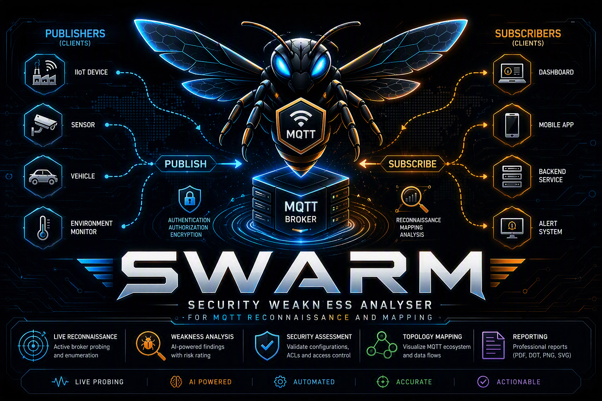

# SWARM
### Security Weakness Analyser for MQTT Reconnaissance and Mapping

[](https://python.org)
[](LICENSE)
[](https://www.blackhat.com/asia-26/arsenal.html)
[](https://anthropic.com)
[](https://anthropic.com)

**AI-powered MQTT security auditor — live probing + SSH auto-fetch + dual-model AI analysis + PDF/DOT/PNG/SVG output**

[Features](#features) • [Quick Start](#quick-start) • [Installation](#installation) • [Usage](#usage) • [Modes](#modes) • [Output](#output) • [Test Lab](#test-lab) • [Architecture](#architecture) • [FAQ](#faq)

</div>

---

## What is SWARM?

SWARM is an open-source security auditing framework built for MQTT broker deployments — the communication backbone of billions of IoT, smart building, and industrial control (ICS/OT) systems.

It connects to a live MQTT broker, actively probes it across **10 attack vectors**, then SSHes into the broker host to automatically retrieve `mosquitto.conf`, ACL files, the password file, and broker logs — all without knowing where those files live. Every piece of collected data is sent to **Claude Sonnet** for deep cross-referenced analysis, then independently validated by a **Claude Haiku** judge that scores each finding's confidence and flags false positives.

The result: a professional PDF pentest report, a DOT/PNG/SVG security topology graph with colour-coded risk, an AI-powered fuzzing strategy, and an interactive expert chatbot pre-loaded with your live broker config.

> **Presented at Black Hat Arsenal India 2026.**

---

## Features

| Feature | Details |
|---|---|
| **10 Live Probe Checks** | Anonymous access, default credentials, TLS, wildcard subscriptions, retained message abuse, rate limiting, oversized payload, client ID collision, and more |
| **SSH Auto-Fetch** | Auto-discovers `mosquitto.conf`, all ACL files, password file, and broker logs — no file paths needed |
| **Dual-Model AI** | Claude Sonnet 4.6 analysis + Claude Haiku 4.5 validation judge with confidence scores per finding |
| **PDF Report** | Recon summary, severity-rated findings (CRITICAL→INFO), Haiku confidence scores, evidence, remediation |
| **Topology Graph** | DOT/PNG/SVG with directional READ/WRITE arrows parsed from ACL, colour-coded by risk |
| **Expert AI Chat** | Chatbot pre-loaded with live broker config, ACL, and logs — context-aware Q&A |
| **SmartFuzz** | AI-generated FUME fuzzer commands based on your specific deployment context |
| **Token-Optimised** | ~$0.07 per full audit — config compression, log filtering, compact JSON |
| **6 Modes** | `audit` · `chat` · `smartfuzz` · `fume` · `diagram` · `manual` |

---

## Quick Start

```bash
# 1. Clone
git clone https://github.com/[your-handle]/swarm.git
cd swarm

# 2. Install dependencies
pip install paho-mqtt reportlab anthropic paramiko

# 3. Set your API key
export ANTHROPIC_API_KEY=sk-ant-...

# 4. Interactive menu
python3 swarm.py

# — OR — full audit directly
python3 swarm.py audit \
  --host 192.168.1.100 \
  --mqtt-user admin --mqtt-pass secret \
  --ssh-user pi --ssh-pass raspberry
```

> **API key:** Sign up at [console.anthropic.com](https://console.anthropic.com) — $5 free credits covers ~70 full audit runs.

---

## Installation

### Requirements

- Python 3.8+
- Anthropic API key ([get one here](https://console.anthropic.com))
- Network access to the target MQTT broker
- SSH access to the broker host *(optional — enables config/ACL/log auto-fetch)*

### Step 1 — Install Python Dependencies

```bash
pip install paho-mqtt reportlab anthropic paramiko
```

| Package | Purpose |
|---|---|
| `paho-mqtt` | Live MQTT broker probing |
| `reportlab` | PDF report generation |
| `anthropic` | Claude Sonnet + Haiku API |
| `paramiko` | SSH auto-fetch of config/ACL/logs |

### Step 2 — Install Graphviz *(optional, for PNG/SVG rendering)*

```bash
# macOS
brew install graphviz

# Debian / Ubuntu / Raspberry Pi OS
sudo apt install graphviz

# Verify
dot -V
```

Without Graphviz, SWARM still generates the `.dot` file. Render it at [dreampuf.github.io/GraphvizOnline](https://dreampuf.github.io/GraphvizOnline) or manually:

```bash
dot -Tpng swarm_topology.dot -o topology.png
dot -Tsvg swarm_topology.dot -o topology.svg
```

### Step 3 — Configure API Key

```bash
# Recommended: environment variable
export ANTHROPIC_API_KEY=sk-ant-...

# Or pass per-run
python3 swarm.py audit --host 192.168.1.100 --api-key sk-ant-...
```

---

## Usage

### Interactive Menu

```bash
python3 swarm.py
```

```
  [1]  Manual Testing      MQTT lab guide + setup instructions
  [2]  AI Audit            Full audit: live probe + SSH + Sonnet + Haiku judge
  [3]  Fuzz with FUME      Evolutionary MQTT broker fuzzing
  [4]  SmartFuzz           AI-targeted fuzzing strategy for your deployment
  [5]  Expert Chat         MQTT security AI assistant
  [6]  Topology Diagram    DOT + PNG + SVG security graph

  Choice [1-6]:
```

### Command Line Reference

```bash
python3 swarm.py <mode> [options]
```

| Option | Default | Description |
|---|---|---|
| `--host` | — | Broker IP or hostname |
| `--mqtt-port` | `1883` | MQTT port |
| `--mqtt-user` | — | MQTT username |
| `--mqtt-pass` | — | MQTT password |
| `--tls` | off | Enable TLS |
| `--ssh-user` | — | SSH username (enables auto-fetch) |
| `--ssh-pass` | — | SSH password |
| `--ssh-key` | — | SSH private key path |
| `--ssh-port` | `22` | SSH port |
| `--api-key` | env var | Anthropic API key |
| `--output` | auto | Output file prefix |

---

## Modes

### `audit` — Full AI Audit ⭐

```bash
# Minimum — live probing only
python3 swarm.py audit --host 192.168.1.100

# Full — live probe + SSH config/ACL/log fetch
python3 swarm.py audit \
  --host 192.168.1.100 \
  --mqtt-user admin --mqtt-pass secret \
  --ssh-user pi --ssh-pass raspberry

# With SSH key auth
python3 swarm.py audit \
  --host 192.168.1.100 \
  --mqtt-user admin --mqtt-pass secret \
  --ssh-user pi --ssh-key ~/.ssh/id_rsa

# TLS broker
python3 swarm.py audit \
  --host 192.168.1.100 --mqtt-port 8883 --tls \
  --mqtt-user admin --mqtt-pass secret \
  --ssh-user pi --ssh-pass raspberry
```

**What runs automatically:**

```
Phase 1 — LIVE MQTT PROBING (10 checks)
  ├── Port reachability (1883, 8883, target)
  ├── Anonymous access         → CRITICAL if CONNACK rc=0
  ├── Default credentials      → tests 15 known pairs
  ├── TLS / Encryption         → handshake on port 8883
  ├── Wildcard subscription    → subscribes to # and $SYS/#
  ├── Retained message abuse   → publishes, reconnects, verifies
  ├── Rate limiting / flood    → 200-msg burst, measures msg/s
  ├── Oversized payload        → sends 512 KB
  └── Client ID collision      → session hijack test

Phase 2 — SSH AUTO-FETCH
  ├── mosquitto.conf           → tries 4 paths + find fallback
  ├── All ACL files            → every acl_file across all listeners
  ├── Password file            → user list (not hashes)
  ├── Broker logs              → tail -500 or journalctl
  ├── Mosquitto version        → /usr/sbin + dpkg fallback
  └── World-readable files, active listeners, service status

Phase 3 — AI ANALYSIS
  ├── Claude Sonnet 4.6        → cross-references all data
  └── Claude Haiku 4.5         → validates findings, confidence %

Phase 4 — OUTPUT
  ├── PDF report
  ├── DOT topology source
  ├── PNG rendered graph
  └── SVG scalable graph
```

---

### `chat` — Expert AI Chatbot

```bash
# General
python3 swarm.py chat

# With live broker context (recommended)
python3 swarm.py chat \
  --host 192.168.1.100 \
  --ssh-user pi --ssh-pass raspberry
```

Example questions:
- *"What is the biggest risk in my current ACL?"*
- *"Which CVEs affect my version of Mosquitto?"*
- *"Write me a hardened mosquitto.conf based on what you found."*
- *"How do I implement per-device topic isolation for 20 ESP32 sensors?"*

Chat commands: `clear` · `save` · `exit`

---

### `smartfuzz` — AI Fuzzing Strategy

```bash
python3 swarm.py smartfuzz

# With live config context
python3 swarm.py smartfuzz \
  --host 192.168.1.100 \
  --ssh-user pi --ssh-pass raspberry

# With architecture context file
python3 swarm.py smartfuzz --context-file ./architecture.txt
```

Interactive prompts ask for number of clients, device types, deployment purpose, and crown jewel asset. SWARM generates targeted `fuzz.py` commands and crown jewel attack paths, then Haiku validates the strategy quality.

---

### `fume` — FUME Fuzzer Integration

Install FUME first:

```bash
git clone https://github.com/PBearson/FUME-Fuzzing-MQTT-Brokers
cd FUME-Fuzzing-MQTT-Brokers && pip install -r requirements.txt && cd ..

python3 swarm.py fume \
  --host 192.168.1.100 \
  --mqtt-user admin --mqtt-pass secret \
  --fume-path ./FUME-Fuzzing-MQTT-Brokers
```

---

### `diagram` — Standalone Topology

```bash
python3 swarm.py diagram \
  --host 192.168.1.100 \
  --ssh-user pi --ssh-pass raspberry
```

---

### `manual` — MQTT Lab Guide

```bash
python3 swarm.py manual
```

Opens the [mqtt-ust](https://github.com/iotsrg/mqtt-ust) structured lab guide — 5 attack scenarios, CVE-2021-34432 RCA, best practices.

---

## Output

| File | Description |
|---|---|
| `*_report.pdf` | Full pentest report — recon + findings + recommendations |
| `*_topology.dot` | Graphviz DOT source |
| `*_topology.png` | Rendered topology (requires graphviz) |
| `*_topology.svg` | Scalable vector topology (requires graphviz) |
| `*_strategy.txt` | SmartFuzz AI strategy (JSON) |
| `swarm_chat_*.txt` | Chat transcript |

### PDF Report Structure

1. Cover (target, score, risk level, date)
2. Executive Summary + Technical Overview
3. Finding count by severity
4. **Reconnaissance Summary**
   - Broker overview (version, service, ports, listeners)
   - Default/weak credentials found
   - ACL users and permission profiles
   - Password file accounts
   - Observed topics from wildcard probe
   - Notable log entries
5. **Security Findings** — each with severity, Haiku confidence %, description, evidence, remediation, CVE reference
6. Positive findings (what is correctly configured)
7. Prioritised recommendations

### Topology Graph Colour Coding

| Colour | Meaning |
|---|---|
| 🔴 Red | CRITICAL/HIGH — anonymous client, sensitive topic, critical finding |
| 🟠 Orange | HIGH — wildcard subscriber, overprivileged client |
| 🟡 Amber | MEDIUM — `$SYS` broker internal topic |
| 🟢 Green | Secure — properly scoped client |
| 🔵 Dark blue | Data topic (sensors, energy, etc.) |

**Arrow directions** parsed from ACL:
- `→ WRITE` (solid) — client publishes to this topic
- `⇢ READ` (dashed) — client subscribes to this topic

---

## Test Lab

SWARM includes a complete vulnerable Raspberry Pi test environment.

### Files

| File | Purpose |
|---|---|
| `mosquitto_simple.conf` | Deliberately vulnerable single-broker config |
| `acl_simple.conf` | 10-client ACL with distinct READ/WRITE profiles |
| `setup_simple.sh` | One-command Pi setup script |
| `simulate_10_nodes.py` | 10-node IoT simulator (paho 1.x + 2.x compatible) |
| `cleanup_pi.sh` | Full cleanup script |

### Setup (one command on Pi)

```bash
sudo bash setup_simple.sh
```

### Client Profiles

| # | Client | Credentials | Vulnerability |
|---|---|---|---|
| 1 | `admin_user` | admin / **admin** | Default cred + wildcard `#` |
| 2 | `esp32_sensor` | esp32 / **esp32** | Default cred + writes `admin/cmd` |
| 3 | `hvac_ctrl` | hvac / **password** | Weak password + reads all sensors |
| 4 | `camera_01` | camera / **camera_01** | Same-as-username + reads `#` |
| 5 | `plc_ctrl` | plc / **12345** | Sequential digits + writes all control |
| 6 | `energy_mgr` | energy / **energy_mgr** | Same-as-username + reads `$SYS/#` |
| 7 | `gateway` | gateway / **raspberry** | Pi default + full wildcard |
| 8 | `ota_server` | ota / **ota_server** | Same-as-username + writes `admin/ota/#` |
| 9 | `monitor_svc` | monitor / `xK9#mP2$vL8n` | ✅ SECURE — read-only, scoped |
| 10 | `audit_svc` | audit / `yR4@nQ7!wZ3k` | ✅ SECURE — specific read + write |

### Run Simulator

```bash
python3 simulate_10_nodes.py              # on Pi (localhost)
python3 simulate_10_nodes.py --host PI_IP # from testing machine
```

Expected: `connected:10  published:XX  errors:0`

### Audit the Lab

```bash
python3 swarm.py audit \
  --host <pi-ip> \
  --mqtt-user admin_user --mqtt-pass admin \
  --ssh-user pi --ssh-pass <pi-password>
```

Expected results: **6× CRITICAL · 4× HIGH · 2× MEDIUM · Score ~2-10/100**

---

## Architecture

```
┌──────────────────────────────────────────────────────────┐
│                    SWARM v1.0                             │
│         swarm.py  ·  Single file  ·  Python 3.8+         │
├──────────────────┬───────────────────────────────────────┤
│   Phase 1        │  Live MQTT Probing  (paho-mqtt)        │
│                  │  10 checks · raw TCP / TLS             │
├──────────────────┼───────────────────────────────────────┤
│   Phase 2        │  SSH Auto-Fetch  (paramiko)            │
│                  │  conf · ACL · passwd · logs            │
├──────────────────┼───────────────────────────────────────┤
│   Phase 3        │  Claude Sonnet 4.6  — Analysis        │
│                  │  Claude Haiku 4.5   — Judge            │
├──────────────────┼───────────────────────────────────────┤
│   Phase 4        │  PDF  (reportlab)                      │
│                  │  DOT + PNG + SVG  (graphviz)           │
└──────────────────┴───────────────────────────────────────┘
```

---

## Vulnerability Coverage

| Check | Maps To | Severity |
|---|---|---|
| Anonymous Access | OWASP IoT I2, Scenario 1 | CRITICAL |
| Default Credentials | OWASP IoT I3, CWE-1392 | CRITICAL |
| No TLS | OWASP IoT I9, CVE-2018-12546 | CRITICAL |
| Wildcard ACL `#` | OWASP IoT I5, Scenario 4 | HIGH |
| Retained Message Abuse | OWASP IoT I5, Scenario 3 | HIGH |
| `$SYS/#` Exposure | OWASP IoT I5, CWE-200 | HIGH |
| ACL Misconfiguration | OWASP IoT I5, Scenario 2 | HIGH |
| No Rate Limiting | OWASP IoT I4, CVE-2017-7651 | MEDIUM |
| Oversized Payload | OWASP IoT I4, Scenario 5 | MEDIUM |
| Client ID Collision | CWE-290, MQTT Spec §3.1.4 | MEDIUM |

---

## Comparison

| Feature | SWARM | MQTTSA | MQTT Explorer | FUME |
|---|---|---|---|---|
| AI-powered analysis | ✅ | ❌ | ❌ | ❌ |
| Dual-model validation | ✅ | ❌ | ❌ | ❌ |
| SSH auto-fetch | ✅ | ❌ | ❌ | ❌ |
| PDF report | ✅ | ✅ | ❌ | ❌ |
| Topology graph | ✅ | ❌ | ❌ | ❌ |
| READ/WRITE arrows | ✅ | ❌ | ❌ | ❌ |
| AI fuzzing strategy | ✅ | ❌ | ❌ | ❌ |
| Expert AI chat | ✅ | ❌ | ❌ | ❌ |
| Actively maintained | ✅ | ❌ (2020) | ✅ | ✅ |

---

## Troubleshooting

**Missing dependencies**
```bash
pip install paho-mqtt reportlab anthropic paramiko
```

**PNG/SVG not generated**
```bash
# Install graphviz
brew install graphviz       # macOS
sudo apt install graphviz   # Linux

# Or render manually
dot -Tpng swarm_topology.dot -o topology.png
```

**SSH connection refused**
```bash
# Ensure SSH is running on the broker host
sudo systemctl start ssh

# Try key-based auth
python3 swarm.py audit --ssh-user pi --ssh-key ~/.ssh/id_rsa --host IP
```

**JSON parse error during AI analysis**
> SWARM automatically retries with stricter constraints. If it fails twice, reduce the amount of context being sent by using a smaller log file.

**Mosquitto version not detected via SSH**
> SWARM tries `/usr/sbin/mosquitto`, `/usr/bin/mosquitto`, and `dpkg` as fallbacks. Version shows as "Not detected" if all fail, but the audit continues normally.

**Topology has no topics**
> Topics only appear when the wildcard probe (`#`) receives messages. Either the broker has ACLs blocking wildcard subscriptions, or no clients are publishing. Run `simulate_10_nodes.py` during the audit to generate live traffic.

---

## FAQ

**Do I need SSH access?**
No. SSH is optional — it enriches the analysis with static config/ACL/log content. Without it, all 10 live probes and AI analysis still run.

**Which brokers are supported?**
Any MQTT broker accessible over TCP. Tested with Mosquitto 1.5.x and 2.0.x. The SSH auto-fetch is Mosquitto-specific; live probing works against any MQTT broker.

**How much does the API cost?**
~$0.07 per full audit run. $5 free credits = ~70 full audits.

**Can I use SWARM without an API key?**
`manual` and `fume` modes work without an API key. `audit`, `chat`, `smartfuzz`, and `diagram` require it for AI analysis.

**Is it safe for production brokers?**
Only run against brokers you own or have explicit written permission to test. The flood test sends 200 messages and the payload test sends 512 KB — lightweight but visible in logs. All SWARM topics use the `swarm/` prefix.

---

## Related Projects

- **[mqtt-ust](https://github.com/iotsrg/mqtt-ust)** — MQTT Mayhem: structured hands-on attack lab (5 scenarios + CVE RCA)
- **[FUME](https://github.com/PBearson/FUME-Fuzzing-MQTT-Brokers)** — Evolutionary MQTT fuzzer — integrated via SWARM's `fume` and `smartfuzz` modes

---

## Contributing

Contributions welcome. Open an issue first to discuss what you'd like to add.

Priority areas:
- Support for HiveMQ, EMQX, VerneMQ
- MQTT v5.0 specific checks
- MQTT over WebSocket probing (port 8083/8084)
- Additional default credential pairs

---

## Disclaimer

For **authorised security testing and educational purposes only**. Do not use against brokers you do not own or have explicit written permission to test.

---

## License

MIT — see [LICENSE](LICENSE)

---

<div align="center">

**SWARM v1.0  ·  Black Hat Arsenal India 2026**

*Built for the IoT and OT security community*

</div>
